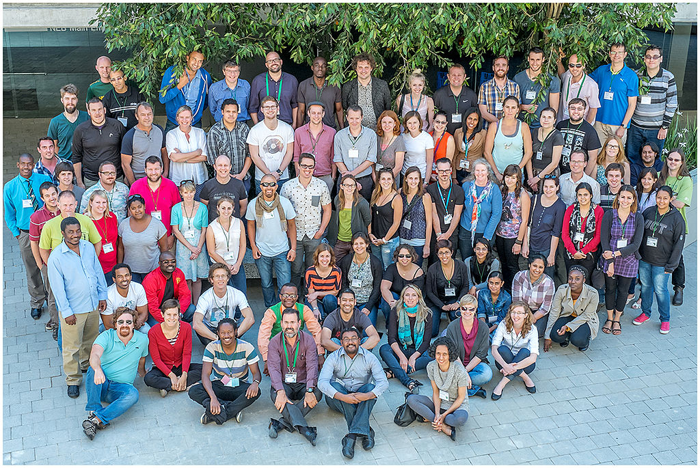
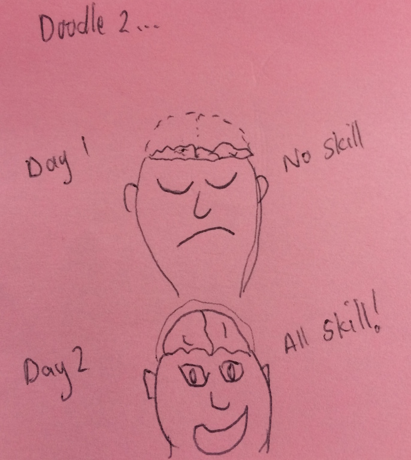

Last week we ran the biggest software carpentry workshop in South Africa to date. We had more than 80 participants in two rooms, each using the novice python material.  Pre-workshop assessment surveys showed that we'd have a mostly novice crew, but with a few outliers on the upper end. We accepted slightly higher than 80 enrollment cap and encouraged those with more advanced skills to evaluate their interest in becoming SWC workshop instructors themselves and help us out as helpers.

Finding participants, local instructors, and helpers was not hard.  Everyone enthusiastically jumped at the opportunity to be involved in a novel way of training newbies and more experienced people in the art of computing for research. Not only was the international community  thrilled to participate and help organise the event, but local institutes, Deans, Professors, Research leaders as well as Research administrators and funders pulled together to sponsor the event and attendance of students.  Partial funding was obtained through a Knowledge, Interchange, and Collaboration grant from the South African National Research Foundation.  When we were running low on sponsorships, the University of Cape Town (UCT) ICTS department and UCT Research Office came to the rescue.  The Bioinformatics Services Platform funded by the Department of Science and Technology also generously contributed funding to sponsor international instructors’ travel.  Furthermore the organizers of the preceding eResearch Africa Conference, the Association of South African University Directors of Information Technology (ASAUDIT), assisted with registration of participants.

Our participants were a good mix of postgraduate students, post-doctoral research fellows, lecturers, researchers and professors, as well as IT specialists and librarians from 11 South African research institutes across four of our country’s provinces joined us at the University of Cape Town.  Three students travelled ~1,300km (from the North West University in Potchefstroom) to attend a two-day Software Carpentry workshop.

We had a relatively even mix of windows, linux and mac computers with linux users sailing through with limited problems. Mac and Windows users had various problems with the most interesting being a locale issue for Mac's set to South African english trying to run ipython notebook (addressed by setting [these shell variables](http://stackoverflow.com/a/15591007)). Other than that there were various issues with old versions of Mac OS not running git without XCode and various other minor issues that were mostly resolvable.

Our instructors traveled from England, The United States, Johannesburg, Pretoria and Cape Town. We had Jonah Duckles and David Menard in the first room and James Hetherington, Bruce Becker and Peter van Heusden in the second room. Prior to the workshop we had worked out who would be teaching various modules and built a jovial and collaborative teaching rapport during the conference leading up to the workshop. Material covered was the standard novice material covering shell, git and python, but not SQL.  We taught shell and git the first day, using a [data git repository](http://github.com/jduckles/uct-data) we had learners clone the data sets to their computer, working out git and network connection bugs as a first-step. We talked about how we'd be learning more about git, but for now to see this `git clone http://github.com/jduckles/uct-data` command as a way to get the files in the repo to our local machine so we could use them. By the end of the first day we had covered shell, git local, git remote and set the stage for learning about python the following day.

The second day covered all of the python modules, going at a pretty slow pace as many learners were new to programming in general. We solicited feedback at each half-day and overall we struck a good balance of challenging learners with new concepts, while not leaving them frustrated and giving up.

By the end of the second day we had a lot of interest in follow-on concepts and learners were excited to see that all of the material they had worked was available online. We had excellent conversations and connections being built around the entirety of the South African research community and the enthusiasm and energy of the participants was evdident, even though their brains were a bit fried by the end.

We had an excellent set of helpers coming from various institutions: Dane Kennedy (CSIR), Hein de Jager (UCT), Ashley Rustin (UCT), David Matten (SU), Armin Deffur (UCT), Anelda van der Walt (UCT), Warren Jacobus (UWC), Chris Mitsengu (UCT), Gustavo Salazar (UCT), Jon Ambler (UCT), Benjamin Hugo (UCT), Jon Zwart (UCT), Adrianna Pinska (UCT), Timothy Povall (UCT). They were very enthusiastic and were also learning new things while helping to get learners moving through various techincal challenges and hands-on exercises.
